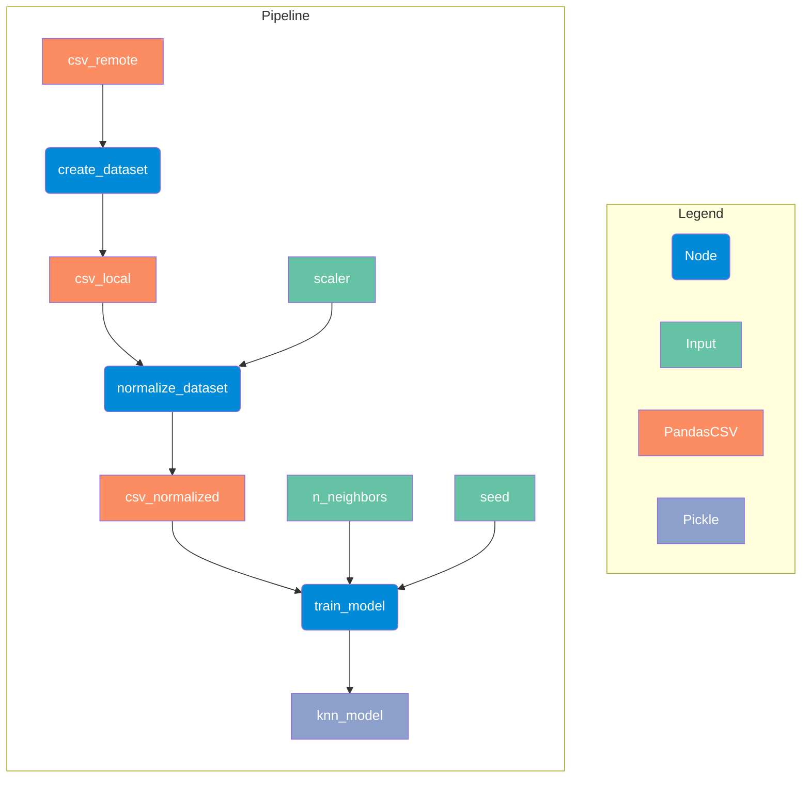

# Kubeflow integration

Ordeq allows you to define your data processing pipelines independently of the orchestration tool.
This separation of concerns leads to more modular, reusable, and testable code, making it easier to maintain and evolve your data processing workflows over time.
This guide demonstrates how to use Ordeq to define a machine learning pipeline and then orchestrate it using Kubeflow.

!!! info "Example code"

    The complete example code for this guide is available in the [Ordeq GitHub repository](https://github.com/ing-bank/ordeq/tree/main/examples/orchestration-kubeflow).

We will first recreate this example pipeline using Ordeq. Next, we will show how to orchestrate that pipeline using Kubeflow

## The ML pipeline

We base our example on a simple machine learning pipeline that trains a K-Nearest Neighbors (KNN) classifier on the Iris dataset.
The example is available in the [Kubeflow Pipelines documentation](https://www.kubeflow.org/docs/components/pipelines/user-guides/core-functions/build-advanced-pipeline/).
The pipeline consists of the following steps:

- `create_dataset`: Downloads the Iris dataset from a remote URL and saves it as a local CSV file.
- `normalize_dataset`: Normalizes the dataset using either Min-Max scaling or Standard scaling.
- `train_model`: Trains a KNN classifier on the normalized dataset and saves the trained model as a pickle file.

## Creating the Ordeq pipeline

Now that the code is written using Ordeq, we can focus on the domain logic without worrying about the orchestration details.

- `create_dataset`: With Ordeq, the copying of the CSV from remote to local comes nearly for free. This step is reduced to setting up the `ordeq_pandas.PandasCSV` IOs and defining the node.

```python title="ml_pipeline/preprocessing.py"
--8<-- "examples/orchestration-kubeflow/ml_pipeline/preprocessing.py:10:13"
```

```python title="ml_pipeline/catalog.py"
--8<-- "examples/orchestration-kubeflow/ml_pipeline/catalog.py:7:18"
```

- `normalize_dataset`: Now that Ordeq handles the IOs, we observe that the `standard_scaler` and `min_max_scaler` boolean flags could be simplified to a single `scaler` parameter that takes a string value. This makes the node definition cleaner and easier to understand.

```python title="ml_pipeline/preprocessing.py"
--8<-- "examples/orchestration-kubeflow/ml_pipeline/preprocessing.py:16:34"
```

```python title="ml_pipeline/catalog.py"
--8<-- "examples/orchestration-kubeflow/ml_pipeline/catalog.py:20:23"
```

- `train_model`: Similarly, the model training node is simplified by removing the IO handling code, allowing us to focus solely on the model training logic.
    For example, the random state that was hardcoded before is now passed as a parameter to the node, making sure that the code is reproducible when needed, but splits randomly by default.
    This is a key example where orchestration-specific code may interfere with the domain logic, in this case soundness of the ML model training.

```python title="ml_pipeline/train.py"
--8<-- "examples/orchestration-kubeflow/ml_pipeline/train.py"
```

```python title="ml_pipeline/catalog.py"
--8<-- "examples/orchestration-kubeflow/ml_pipeline/catalog.py:25:27"
```

## Running the pipeline locally

With the pipeline defined using Ordeq, we can now run it locally.
With Ordeq, this is as simple as calling the `run` function with the final node and the desired parameters.

```python title="run_local.py"
--8<-- "examples/orchestration-kubeflow/run_local.py"
```

Apart from the readability and maintainability improvements in the pipeline code, we also get a nice visualization of the pipeline structure when running it locally:



## Running the pipeline with Kubeflow

The final step is to orchestrate the pipeline using Kubeflow.
Without loss of Kubeflow-specific functionality, such as "Output" or "Dataset" types, we can define the Kubeflow pipeline by wrapping the Ordeq nodes in Kubeflow components.

!!! info "More roads lead to Rome"

    There are many ways to map Ordeq nodes to Kubeflow components.
    This is just one example of how it can be done.
    The key point is that the core logic of the nodes remains unchanged, and only the orchestration-specific code is added around it.

For example, we can define the Kubeflow components as follows:

```python title="run_kubeflow.py"
--8<-- "examples/orchestration-kubeflow/run_kubeflow.py"
```

Since the engineer defining the Kubeflow pipeline does not need to worry about the core logic of the nodes, they can focus on the orchestration-specific aspects.
For example, the Python dependencies for each component might be automatically taken from the project's packaging configuration (e.g., `pyproject.toml` or `requirements.txt`), rather than being hardcoded in the Kubeflow component definitions.
