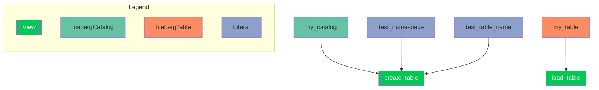

## Resource

```python
from datetime import datetime, timedelta

import pyiceberg.types as T
from ordeq import node, run
from ordeq_common import Literal
from ordeq_iceberg import IcebergCatalog, IcebergTable
from ordeq_viz import viz
from pyiceberg.catalog import Catalog, CatalogType
from pyiceberg.schema import Schema
from pyiceberg.table import Table

# Catalog

my_catalog = IcebergCatalog(
    name="test_catalog", catalog_type=CatalogType.IN_MEMORY
)

test_namespace = Literal[str]("test_namespace")
test_table_name = Literal[str]("test_table")

my_table = IcebergTable(
    catalog=my_catalog,
    table_name=test_table_name.value,
    namespace=test_namespace.value,
)

# Nodes


@node(inputs=[my_catalog, test_namespace, test_table_name], checks=[my_table])
def create_table(catalog: Catalog, namespace: str, table_name: str) -> None:
    catalog.create_namespace_if_not_exists(namespace)
    catalog.create_table_if_not_exists(
        (namespace, table_name),
        schema=Schema(
            *T.StructType(
                T.NestedField(1, "id", T.IntegerType(), required=True),
                T.NestedField(2, "data", T.StringType(), required=False),
            ).fields
        ),
    )


@node(inputs=[my_table])
def load_table(created_table: Table) -> None:
    print(f"Table loaded from Input object: '{created_table}'")
    last_month = datetime.now() - timedelta(days=30)
    created_table.maintenance.expire_snapshots().older_than(last_month)


print(f"Viz Diagram:/n```/n{viz(__name__, fmt='mermaid-md')}/n```")
run(load_table, create_table)

```

## Output

```text
Viz Diagram:
```


```
Table loaded from Input object: 'test_table(
  1: id: required int,
  2: data: optional string
),
partition by: [],
sort order: [],
snapshot: null'

```

## Logging

```text
WARNING	ordeq.preview	Checks are in preview mode and may change without notice in future releases.
INFO	ordeq.io	Loading IcebergCatalog 'create_table:catalog' in module '__main__'
DEBUG	ordeq.io	Persisting data for IcebergCatalog 'create_table:catalog' in module '__main__'
INFO	ordeq.io	Loading Literal 'create_table:namespace' in module '__main__'
DEBUG	ordeq.io	Persisting data for Literal 'create_table:namespace' in module '__main__'
INFO	ordeq.io	Loading Literal 'create_table:table_name' in module '__main__'
DEBUG	ordeq.io	Persisting data for Literal 'create_table:table_name' in module '__main__'
INFO	ordeq.runner	Running view 'create_table' in module '__main__'
DEBUG	ordeq.io	Persisting data for IO(id=ID1)
INFO	ordeq.io	Loading IcebergTable 'load_table:created_table' in module '__main__'
DEBUG	ordeq.io	Loading cached data for IcebergCatalog 'create_table:catalog' in module '__main__'
DEBUG	ordeq.io	Persisting data for IcebergTable 'load_table:created_table' in module '__main__'
INFO	ordeq.runner	Running view 'load_table' in module '__main__'
DEBUG	ordeq.io	Persisting data for IO(id=ID2)
DEBUG	ordeq.io	Unpersisting data for IcebergCatalog 'create_table:catalog' in module '__main__'
DEBUG	ordeq.io	Unpersisting data for Literal 'create_table:namespace' in module '__main__'
DEBUG	ordeq.io	Unpersisting data for Literal 'create_table:table_name' in module '__main__'
DEBUG	ordeq.io	Unpersisting data for IO(id=ID1)
DEBUG	ordeq.io	Unpersisting data for IcebergTable 'load_table:created_table' in module '__main__'
DEBUG	ordeq.io	Unpersisting data for IO(id=ID2)

```