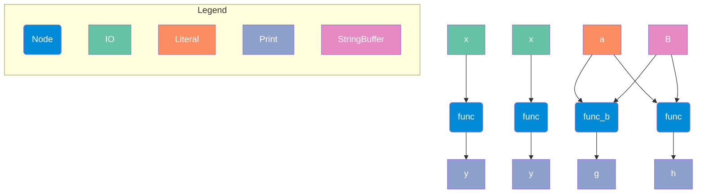

## Resource

```python
import example_project

from ordeq_viz import viz

result = viz(
    example_project,
    fmt="mermaid-md",
    node_filter=lambda n: n.attributes.get("tags", "x") != "x",
    output=None,
)
print(result)

```

## Output

```text



```

## Logging

```text
WARNING	ordeq.preview	Creating a view, as no outputs were provided for node 'example_project.nodes_with_view:greet'. Views are in pre-release, functionality may break without notice. Use @node(outputs=...) to create a regular node. 
WARNING	ordeq.preview	Node filters are in preview mode and may change without notice in future releases.

```