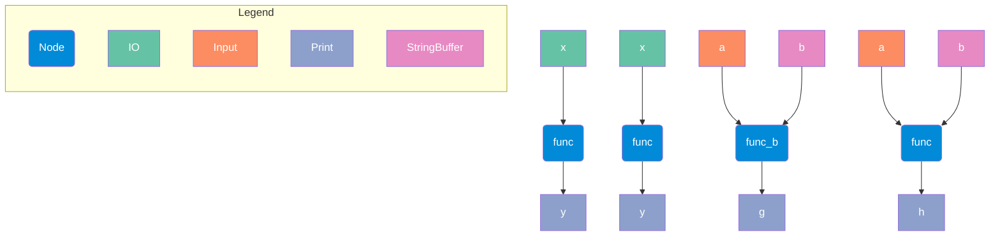

## Resource

```python
import example_project

from ordeq_viz import viz

result = viz(
    example_project,
    fmt="mermaid-md",
    node_filter=lambda n: n.attributes.get("tags", "x") != "x",
    output=None,
)
print(result)

```

## Output

```text



```

## Logging

```text
DEBUG	ordeq.io	Persisting data for Input(id=ID1)
DEBUG	ordeq.io	Persisting data for Input(id=ID2)
DEBUG	ordeq.io	Persisting data for Input(id=ID3)
DEBUG	ordeq.io	Persisting data for Input(id=ID4)
WARNING	ordeq.preview	Node filters are in preview mode and may change without notice in future releases.

```