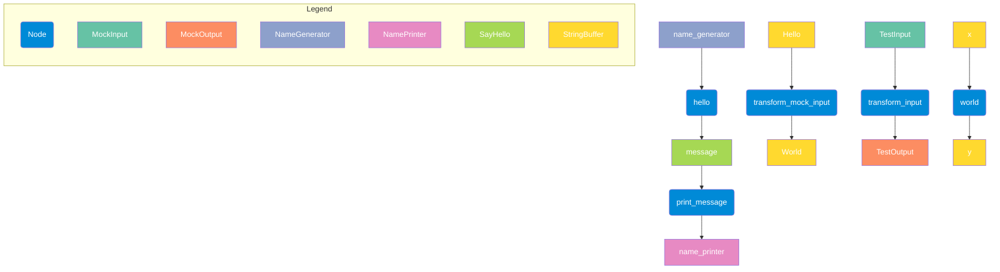

## Resource

```python
from ordeq_viz import viz

result = viz("example_1", fmt="mermaid-md", output=None)
print(result)

```

## Output

```text

```mermaid
graph TB
	subgraph legend["Legend"]
		direction TB
		node_type@{shape: rounded, label: "Node"}
		io_type_0@{shape: rect, label: "MockInput"}
		io_type_1@{shape: rect, label: "MockOutput"}
		io_type_2@{shape: rect, label: "NameGenerator"}
		io_type_3@{shape: rect, label: "NamePrinter"}
		io_type_4@{shape: rect, label: "SayHello"}
		io_type_5@{shape: rect, label: "StringBuffer"}
	end

	example_1.wrapped_io:name_generator --> example_1.wrapped_io:hello
	example_1.wrapped_io:hello --> example_1.wrapped_io:message
	example_1.wrapped_io:message --> example_1.wrapped_io:print_message
	example_1.wrapped_io:print_message --> example_1.wrapped_io:name_printer
	example_1.catalog:Hello --> example_1.pipeline:transform_mock_input
	example_1.pipeline:transform_mock_input --> example_1.catalog:World
	example_1.catalog:TestInput --> example_1.pipeline:transform_input
	example_1.pipeline:transform_input --> example_1.catalog:TestOutput
	example_1.nodes:x --> example_1.nodes:world
	example_1.nodes:world --> example_1.nodes:y

	example_1.wrapped_io:hello@{shape: rounded, label: "hello"}
	example_1.wrapped_io:print_message@{shape: rounded, label: "print_message"}
	example_1.wrapped_io:message@{shape: rect, label: "message"}
	example_1.pipeline:transform_mock_input@{shape: rounded, label: "transform_mock_input"}
	example_1.pipeline:transform_input@{shape: rounded, label: "transform_input"}
	example_1.nodes:world@{shape: rounded, label: "world"}
	example_1.catalog:Hello@{shape: rect, label: "Hello"}
	example_1.catalog:TestInput@{shape: rect, label: "TestInput"}
	example_1.catalog:TestOutput@{shape: rect, label: "TestOutput"}
	example_1.catalog:World@{shape: rect, label: "World"}
	example_1.nodes:x@{shape: rect, label: "x"}
	example_1.nodes:y@{shape: rect, label: "y"}
	example_1.wrapped_io:name_generator@{shape: rect, label: "name_generator"}
	example_1.wrapped_io:name_printer@{shape: rect, label: "name_printer"}

	class node_type,example_1.wrapped_io:hello,example_1.wrapped_io:print_message,example_1.pipeline:transform_mock_input,example_1.pipeline:transform_input,example_1.nodes:world node
	class io_type_0,example_1.catalog:TestInput io0
	class io_type_1,example_1.catalog:TestOutput io1
	class io_type_2,example_1.wrapped_io:name_generator io2
	class io_type_3,example_1.wrapped_io:name_printer io3
	class io_type_4,example_1.wrapped_io:message io4
	class io_type_5,example_1.catalog:Hello,example_1.catalog:World,example_1.nodes:x,example_1.nodes:y io5
	classDef node fill:#008AD7,color:#FFF
	classDef io fill:#FFD43B
	classDef io0 fill:#66c2a5
	classDef io1 fill:#fc8d62
	classDef io2 fill:#8da0cb
	classDef io3 fill:#e78ac3
	classDef io4 fill:#a6d854
	classDef io5 fill:#ffd92f

```


```