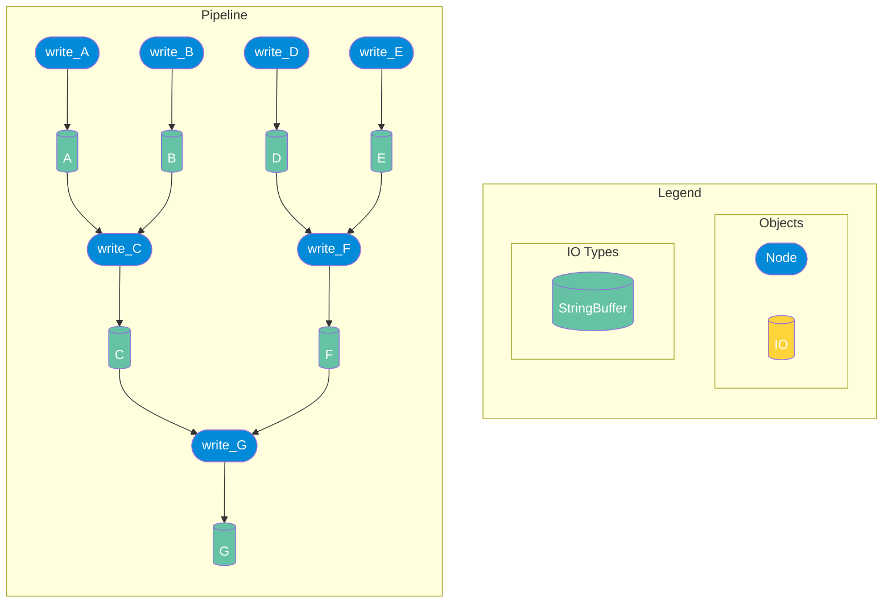

```mermaid
graph TB
	subgraph legend["Legend"]
		direction TB
		subgraph Objects
			L0(["Node"]):::node
			L1[("IO")]:::io
		end
		subgraph IO Types
			L00[("StringBuffer")]:::io0
		end
	end

	write_E --> IO0
	write_D --> IO1
	write_B --> IO2
	write_A --> IO3
	IO1 --> write_F
	IO0 --> write_F
	write_F --> IO4
	IO3 --> write_C
	IO2 --> write_C
	write_C --> IO5
	IO5 --> write_G
	IO4 --> write_G
	write_G --> IO6

	subgraph pipeline["Pipeline"]
		direction TB
		write_E(["write_E"]):::node
		write_D(["write_D"]):::node
		write_B(["write_B"]):::node
		write_A(["write_A"]):::node
		write_F(["write_F"]):::node
		write_C(["write_C"]):::node
		write_G(["write_G"]):::node
		IO0[("E")]:::io0
		IO1[("D")]:::io0
		IO2[("B")]:::io0
		IO3[("A")]:::io0
		IO4[("F")]:::io0
		IO5[("C")]:::io0
		IO6[("G")]:::io0
	end

	classDef node fill:#008AD7,color:#FFF
	classDef io fill:#FFD43B
	classDef io0 fill:#66c2a5
```